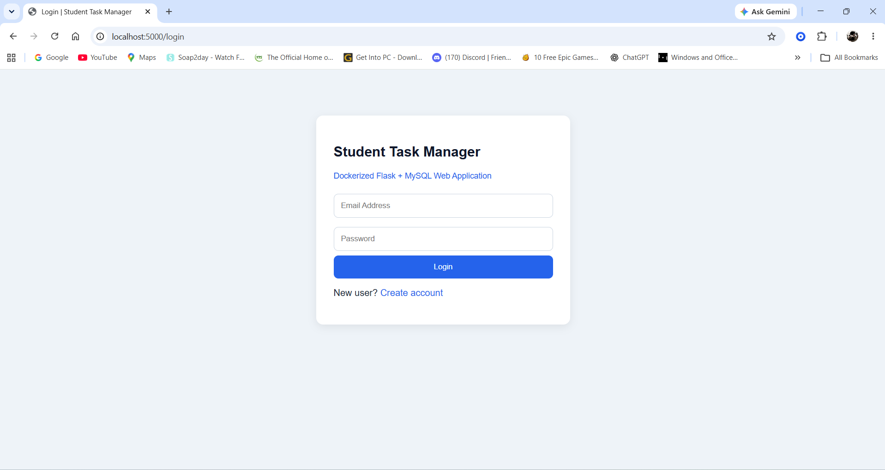
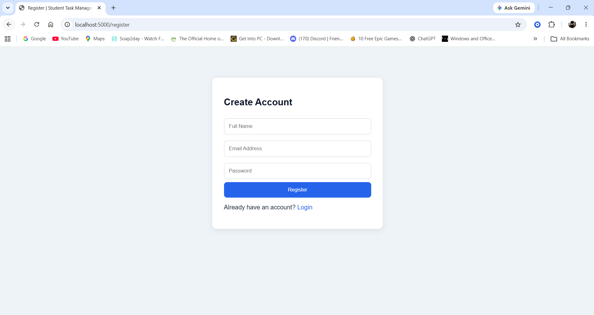
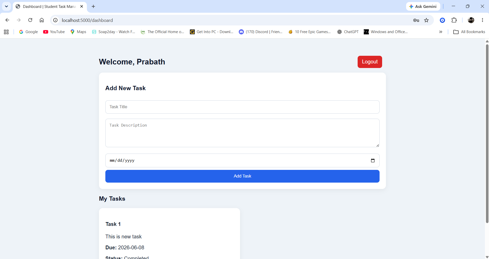
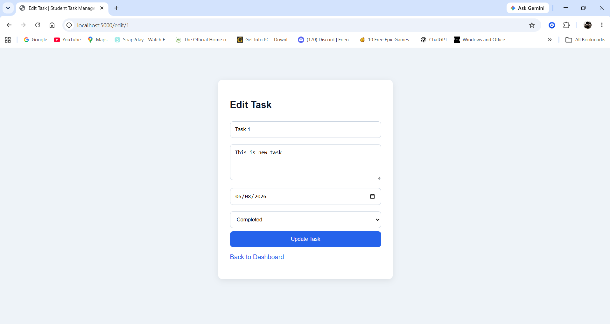
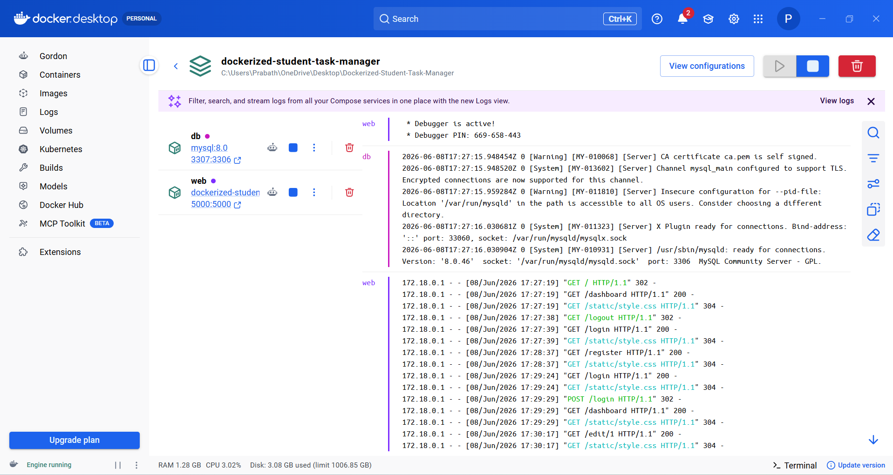

# Dockerized Student Task Manager

A web-based student task management application built with **Python Flask**, **MySQL**, **Docker**, and **Docker Compose**. The system allows users to register, log in, manage tasks, and store task records in a MySQL database running inside a Docker container.

This project was developed to demonstrate practical knowledge of web development, database integration, containerization, and multi-container application setup using Docker.

---

## Project Overview

The Dockerized Student Task Manager is a simple CRUD-based web application designed for students to manage their daily academic tasks. Users can create an account, log in, add tasks, update task details, mark tasks as completed, and delete tasks.

The main purpose of this project is to demonstrate how a Flask web application can be containerized using Docker and connected to a MySQL database using Docker Compose.

---

## Features

* User registration
* User login and logout
* Password hashing for secure authentication
* Add new tasks
* View personal task list
* Edit task details
* Mark tasks as completed
* Delete tasks
* MySQL database integration
* Dockerized Flask application
* Multi-container setup using Docker Compose
* Persistent database storage using Docker volumes
* Environment variable configuration using `.env`

---

## Technologies Used

* Python
* Flask
* MySQL
* Docker
* Docker Compose
* HTML
* CSS
* Git
* GitHub

---

## Project Structure

```text
Dockerized-Student-Task-Manager/
│
├── app/
│   ├── static/
│   │   └── style.css
│   │
│   ├── templates/
│   │   ├── login.html
│   │   ├── register.html
│   │   ├── dashboard.html
│   │   └── edit_task.html
│   │
│   ├── app.py
│   ├── db.py
│   └── requirements.txt
│
├── mysql/
│   └── init.sql
│
├── screenshots/
│   ├── login-page.png
│   ├── register-page.png
│   ├── dashboard-page.png
│   ├── edit-task.png
│   └── docker-containers.png
│
├── Dockerfile
├── docker-compose.yml
├── .env.example
├── .gitignore
└── README.md
```

---

## Docker Services

This project uses two Docker services:

| Service | Description                           |
| ------- | ------------------------------------- |
| `web`   | Runs the Python Flask web application |
| `db`    | Runs the MySQL database server        |

The services are managed using `docker-compose.yml`.

---

## Environment Variables

Create a `.env` file in the main project folder and add the following details:

```env
MYSQL_HOST=db
MYSQL_USER=task_user
MYSQL_PASSWORD=task_password
MYSQL_DATABASE=student_tasks
MYSQL_ROOT_PASSWORD=root_password
FLASK_SECRET_KEY=prabath_student_task_manager_2026_secret
```

A sample file named `.env.example` is included in the project.

Important: The `.env` file should not be uploaded to GitHub because it contains secret keys and passwords.

---

## How to Run the Project

### Step 1: Clone the Repository

```bash
git clone https://github.com/Prabath397/Dockerized-Student-Task-Manager.git
```

### Step 2: Open the Project Folder

```bash
cd Dockerized-Student-Task-Manager
```

### Step 3: Create the `.env` File

Create a `.env` file in the main folder and copy the values from `.env.example`.

### Step 4: Start the Application

```bash
docker compose up --build
```

### Step 5: Open the Application

Open your browser and go to:

```text
http://localhost:5000
```

---

## How to Stop the Application

To stop the running containers:

```bash
docker compose down
```

To stop the containers and remove the database volume:

```bash
docker compose down -v
```

Note: Using `-v` will delete the saved MySQL data.

---

## Screenshots

### Login Page



### Register Page



### Dashboard Page



### Edit Task Page



### Docker Containers Running



---

## Main Functionalities

### User Registration

Users can create an account using their name, email address, and password. Passwords are securely hashed before saving to the database.

### User Login

Registered users can log in using their email and password.

### Task Management

Users can add, edit, complete, and delete their own tasks.

### Database Storage

User and task details are stored in a MySQL database container.

### Docker Containerization

The Flask application and MySQL database run in separate Docker containers using Docker Compose.

---

## Future Improvements

* Add an admin dashboard
* Add task priority levels
* Add task categories
* Add search and filter options
* Add task due-date reminders
* Add email notifications
* Improve UI design
* Deploy the project to a cloud platform

---

## Skills Demonstrated

* Python web development
* Flask application development
* MySQL database integration
* CRUD operations
* User authentication
* Docker containerization
* Docker Compose multi-container setup
* Environment variable handling
* Git and GitHub project management
* Software project documentation

---

## Author

**Prabath Udayanga Jayasuriya**

* GitHub: https://github.com/Prabath397
* Portfolio: https://prabath397.github.io
* LinkedIn: https://www.linkedin.com/in/prabath-jayasuriya

---

## License

This project is created for academic and learning purposes.
